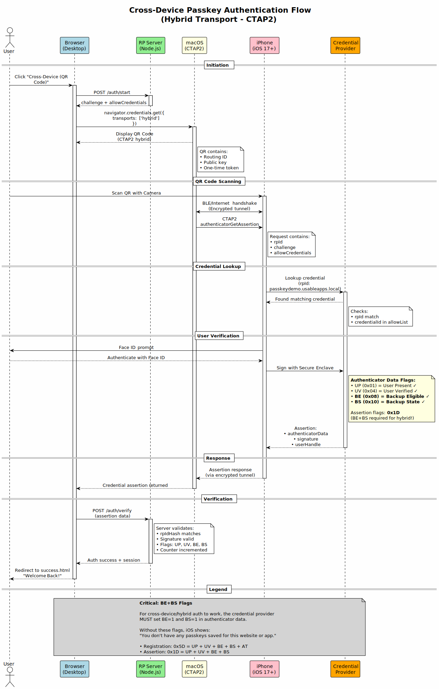

# iOS Device-Bound Passkey Demo

A reference implementation of **hardware-bound passkeys** on iOS using Apple's Secure Enclave. This project demonstrates genuine device-bound credential storage that cannot be synced, exported, or cloned.

[](https://www.gnu.org/licenses/gpl-3.0)

## Overview

This implementation proves that passkeys can be truly device-bound on iOS, even when using third-party credential provider extensions. The private key is generated inside the Secure Enclave and never exists in extractable form.

### Demo

https://github.com/user-attachments/assets/d85b3ee4-24f1-445f-b405-086447a28023

> Device-bound passkey registration and authentication on iOS using Secure Enclave.

---

## Table of Contents

- [Features](#features)
- [Architecture](#architecture)
- [Security Model](#security-model)
- [WebAuthn Compliance](#webauthn-compliance)
- [The BE/BS Flag Paradox](#the-bebs-flag-paradox)
- [Getting Started](#getting-started)
- [Implementation Details](#implementation-details)
- [Security Considerations](#security-considerations)
- [Troubleshooting](#troubleshooting)
- [References](#references)

---

## Features

| Feature | Description |
|---------|-------------|
| **Secure Enclave Keys** | Private keys generated inside hardware, never in memory |
| **Device-Only Storage** | `kSecAttrAccessibleWhenUnlockedThisDeviceOnly` prevents iCloud sync |
| **Biometric Binding** | `.biometryCurrentSet` invalidates keys if biometrics change |
| **Apple App Attestation** | Cryptographic proof of genuine Apple hardware |
| **Hybrid Transport** | Cross-device authentication via QR code scanning |
| **WebAuthn RP Server** | Full registration and authentication ceremony implementation |

---

## Architecture

```
┌─────────────────────────────────────────────────────────────────┐
│                         iOS System                               │
├─────────────────────────────────────────────────────────────────┤
│                                                                  │
│  ┌──────────────┐    ┌──────────────┐    ┌──────────────────┐  │
│  │  Main App    │    │   System     │    │  Credential      │  │
│  │              │───▶│  Credential  │───▶│  Provider        │  │
│  │ (Triggers    │    │   Picker     │    │  Extension       │  │
│  │  request)    │    │              │    │                  │  │
│  └──────────────┘    └──────────────┘    └────────┬─────────┘  │
│                                                    │            │
│                                          ┌────────▼─────────┐  │
│                                          │  Secure Enclave  │  │
│                                          │  (Device-Bound)  │  │
│                                          └──────────────────┘  │
└─────────────────────────────────────────────────────────────────┘
```

### Cross-Device Authentication Flow



### Components

| Component | Path | Description |
|-----------|------|-------------|
| **Credential Provider Extension** | `mobile/CredentialProvider/` | Generates P-256 keys in Secure Enclave, handles WebAuthn ceremonies |
| **WebAuthn Relying Party** | `web/` | Express server with registration/authentication endpoints and AASA |
| **Main App** | `mobile/PasskeyDemo/` | Triggers credential picker, manages lifecycle |

---

## Security Model

### Device-Bound vs Synced Passkeys

| Property | Device-Bound (This Demo) | Synced (iCloud Keychain) |
|----------|--------------------------|--------------------------|
| Storage | Secure Enclave | iCloud Keychain |
| Extractable | No | No (but synced) |
| Cross-device | Via hybrid transport only | Automatic via iCloud |
| Survives device loss | No | Yes |
| Clone detection | Signature counter | N/A |

### Secure Enclave Guarantees

This implementation follows Apple's [Protecting Keys with the Secure Enclave](https://developer.apple.com/documentation/security/protecting-keys-with-the-secure-enclave) documentation:

| Requirement | Implementation |
|-------------|----------------|
| Availability check | `SecureEnclave.isAvailable` |
| Device-only storage | `kSecAttrAccessibleWhenUnlockedThisDeviceOnly` |
| Biometric binding | `.biometryCurrentSet` access control |
| Key usage restriction | `.privateKeyUsage` flag |
| Algorithm | `SecureEnclave.P256.Signing.PrivateKey` (ECDSA) |
| Storage format | Encrypted `dataRepresentation`, not raw key |

---

## WebAuthn Compliance

### Implementation Status

| Requirement | Status | Implementation |
|-------------|--------|----------------|
| Challenge generation | ✅ | Cryptographically random via `@simplewebauthn/server` |
| Challenge expiration | ✅ | 5-minute timeout enforced |
| Origin validation | ✅ | `expectedOrigin` verified |
| RP ID validation | ✅ | `expectedRPID` verified |
| User verification | ✅ | `requireUserVerification: true` |
| User presence | ✅ | UP flag checked |
| Signature counter | ✅ | Incremented and verified ([§6.1.1](https://www.w3.org/TR/webauthn-2/#sctn-sign-counter)) |
| HTTPS transport | ✅ | TLS required |
| Credential storage | ✅ | Public key + metadata persisted |

### Authenticator Flags

```
Registration: 0x5D = UP(0x01) + UV(0x04) + BE(0x08) + BS(0x10) + AT(0x40)
Assertion:    0x1D = UP(0x01) + UV(0x04) + BE(0x08) + BS(0x10)
```

---

## The BE/BS Flag Paradox

iOS requires `BE` (Backup Eligible) and `BS` (Backup State) flags for third-party credential providers to participate in hybrid/cross-device authentication. Without these flags, registration fails:

> "The operation either timed out or was not allowed."

### The Contradiction

| Aspect | What BE=1/BS=1 Declares | What Actually Happens |
|--------|-------------------------|----------------------|
| Protocol Level | "Credential is backup-eligible" | iOS uses this to allow hybrid transport |
| Hardware Level | N/A | Secure Enclave key cannot be exported |
| Keychain Level | N/A | `kSecAttrAccessibleWhenUnlockedThisDeviceOnly` blocks sync |
| Relying Party View | May assume credential syncs | Private key never leaves device |

### Why This Matters

A relying party receiving BE=1/BS=1 might assume the credential could be backed up. However, actual security is determined by:

1. **Secure Enclave** - Keys generated in hardware, cannot be extracted
2. **Keychain access control** - Prevents iCloud Keychain sync
3. **Key representation** - Only encrypted reference stored, not raw key

**This implementation intentionally does not sync** - that is the desired behavior. The BE/BS flags are a protocol requirement, not a security override.

### References

- [W3C WebAuthn Level 3 - Authenticator Data Flags](https://www.w3.org/TR/webauthn-3/#sctn-authenticator-data)
- [Apple Developer Forums - BE/BS flags requirement](https://developer.apple.com/forums/thread/742209)
- [MDN Web Docs - Authenticator Data](https://developer.mozilla.org/en-US/docs/Web/API/Web_Authentication_API/Authenticator_data)

---

## Getting Started

### Prerequisites

- iOS 17+
- Xcode 15+
- Node.js 18+
- Physical iOS device (Secure Enclave not available in Simulator)

### 1. Start the Server

```bash
cd web
npm install
npm start
```

### 2. Configure Xcode

1. Open `mobile/PasskeyDemo.xcodeproj`
2. For **both** PasskeyDemo and CredentialProvider targets:
   - Select your Development Team
   - Update Bundle ID if needed

### 3. Update AASA

In `web/server.js`, replace the Team ID:

```javascript
webcredentials: {
  apps: ['YOUR_TEAM_ID.com.demo.PasskeyDemo']
}
```

### 4. Enable Credential Provider

1. **Settings** → **Passwords** → **Password Options**
2. Enable **Passkey Demo Provider**

### 5. Trust Certificate (Development)

1. Install server certificate on iOS device
2. **Settings** → **General** → **About** → **Certificate Trust Settings**
3. Enable full trust

---

## Implementation Details

### Secure Enclave Key Generation

```swift
guard SecureEnclave.isAvailable else { throw ... }

let accessControl = SecAccessControlCreateWithFlags(
    kCFAllocatorDefault,
    kSecAttrAccessibleWhenUnlockedThisDeviceOnly,  // No sync
    [.privateKeyUsage, .biometryCurrentSet],       // Hardware + biometric
    &error
)

let privateKey = try SecureEnclave.P256.Signing.PrivateKey(
    accessControl: accessControl
)
```

### Apple App Attestation

```swift
appAttestService.generateKey { keyID, error in
    appAttestService.attestKey(keyID, clientDataHash: clientDataHash) { attestation, error in
        // Send to server for verification
    }
}
```

---

## Security Considerations

### Production Checklist

| Item | Demo Status | Production Requirement |
|------|-------------|----------------------|
| **Challenge expiration** | ✅ 5 minutes | Enforce timeout, reject expired |
| **Signature counter** | ⚠️ Logs warning | Reject non-increasing counters |
| **App Attestation** | ⚠️ Not verified | Verify Apple CA chain |
| **AAGUID** | ⚠️ Zero (anonymous) | Register with FIDO Alliance |
| **Debug endpoints** | ⚠️ Exposed | Remove or authenticate |
| **HTTPS** | ✅ Required | Use valid CA certificate |
| **Credential management** | ⚠️ Debug only | User-facing UI for removal |

### Challenge-Based Replay Prevention

The random challenge is the **primary defense** against replay attacks ([WebAuthn §13.4.3](https://www.w3.org/TR/webauthn-2/#sctn-cryptographic-challenges)):

- Server generates cryptographically random challenge
- Challenge bound to ceremony via `clientDataHash`
- Challenge expires after 5 minutes
- Each ceremony requires fresh challenge

### Signature Counter (Clone Detection)

The signature counter is a **secondary signal** for detecting cloned authenticators ([WebAuthn §6.1.1](https://www.w3.org/TR/webauthn-2/#sctn-sign-counter)):

- Counter increments on each assertion
- Server verifies counter > stored value
- Non-increasing counter suggests cloned authenticator
- Demo logs warning; production should reject

### AAGUID Considerations

This demo uses zero AAGUID (16 null bytes):

- Valid for self-attestation
- Anonymous to relying parties
- Cannot enforce authenticator policies

For production:
- Generate unique AAGUID for your authenticator
- Register with [FIDO Alliance Metadata Service](https://fidoalliance.org/metadata/)
- Enables RP trust policies based on authenticator identity

### App Attestation Verification

The demo receives but does not fully verify Apple App Attestation:

**Production requirements:**
1. Verify attestation against Apple's App Attest root CA
2. Validate the `clientDataHash` matches the challenge
3. Confirm App ID matches your bundle identifier
4. Check key ID format and validity

See: [Establishing Your App's Integrity](https://developer.apple.com/documentation/devicecheck/establishing-your-app-s-integrity)

### Known Limitations

| Limitation | Impact | Mitigation |
|------------|--------|------------|
| BE/BS flags required | RPs may assume sync capability | Document behavior, use attestation |
| No credential management UI | Users cannot remove credentials | Implement in production |
| Self-signed certificates | Development only | Use trusted CA in production |

---

## Troubleshooting

| Issue | Symptom | Solution |
|-------|---------|----------|
| Extension not offered | Credential picker doesn't show provider | Verify `ProvidesPasskeys = YES` in Info.plist |
| RPID mismatch | Registration rejected | Ensure `SHA256(rpID.utf8)` is exactly 32 bytes |
| CBOR encoding error | Server rejects attestation | Use proper CBOR map format with sorted keys |
| Counter not incrementing | Assertion warning | Persist `signCounter` after each use |
| Credential not discoverable | Sign-in fails | Call `ASCredentialIdentityStore.shared.saveCredentialIdentities()` |
| Certificate error | Network requests fail | Trust certificate in iOS Settings |

---

## Project Structure

```
passkeys/
├── web/                              # WebAuthn Relying Party Server
│   ├── server.js                     # Express server with AASA
│   ├── public/
│   │   ├── index.html                # Demo UI
│   │   └── success.html              # Auth success page
│   └── k8s/
│       └── passkeydemo-deployment.yaml
│
└── mobile/                           # iOS App + Credential Provider
    ├── PasskeyDemo/
    │   ├── PasskeyManager.swift      # Credential lifecycle
    │   └── ContentView.swift         # Demo UI
    │
    ├── CredentialProvider/           # Secure Enclave integration
    │   └── CredentialProviderViewController.swift
    │
    └── PasskeyDemo.xcodeproj/
```

---

## References

### Apple Documentation
- [Protecting Keys with the Secure Enclave](https://developer.apple.com/documentation/security/protecting-keys-with-the-secure-enclave)
- [ASCredentialProviderViewController](https://developer.apple.com/documentation/authenticationservices/ascredentialproviderviewcontroller)
- [App Attest](https://developer.apple.com/documentation/devicecheck/establishing-your-app-s-integrity)
- [preferImmediatelyAvailableCredentials](https://developer.apple.com/documentation/authenticationservices/asauthorizationcontroller/requestoptions/preferimmediatelyavailablecredentials)

### WebAuthn Specifications
- [WebAuthn Level 2](https://www.w3.org/TR/webauthn-2/)
- [WebAuthn Level 3](https://www.w3.org/TR/webauthn-3/)
- [Signature Counter Considerations](https://www.w3.org/TR/webauthn-2/#sctn-sign-counter)

### Additional Resources
- [Yubico WebAuthn Readiness Checklist](https://developers.yubico.com/WebAuthn/WebAuthn_Developer_Guide/WebAuthn_Readiness_Checklist.html)
- [FIDO Alliance Metadata Service](https://fidoalliance.org/metadata/)

---

## License

This project is licensed under the GNU General Public License v3.0 - see the [LICENSE](LICENSE) file for details.
